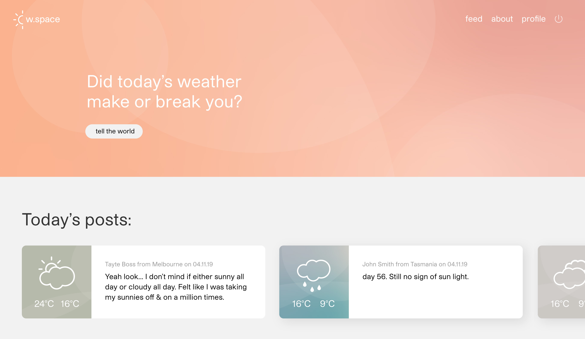

# w-space
**Come praise or complain about the weather :)**

### Tell the world your opinion here
https://wspace-app.herokuapp.com/

## Concept
W-space is a place for those to share their thoughts about the weather no matter where they are.

The concept for this app came to me after I saw a poster at an art gallery coining a new meaning of 'weather anxiety'. It explained how the majority of the population strike up conversations about the weather when in awkward situations. I related significantly to this phenomenon which then lead me to want to create an app for those who 'suffer' from these symptoms. 

Overall the app's tone of voice is light hearted and the UI is minimalistic using splashes of gradients to highlight points of interest. The goal for this app's design was to be a stripped back crud app where the 'logs' are purely texted based accompanied by a graphic symbolising the weather.

## Technology & Concepts used
* Ruby
* Javascript
* JQuery
* SQL
* PSQL
* Heroku
* SASS
* HTML 5

## Challenges
### Flow Control
Flow Control seemed to be reoccuring problem throughout this process.

### Working with Dates
Without frameworks like Rails. I struggled to work with date formats.

### Using Correct Asset Paths
Kept forgetting to reference files & assets from the public folder as the root.

### Redirecting if User Not Logged In
Learning to use guard statements to check if a user was a logged in was a big help instead of using if/else statements.

## Lessons Learned
* Don't worry about refactoring till logic is complete
* Start designing once you know most/all the features in the app(to avoid time spent re-designing)
* Utilising 'session' to store data

## WIP
* Implementing a weather API for realtime weather (randomised weather at the moment)
* Find users location
* Commenting & up/down-voting logs
* Search particular users
* Follow particular users
* Refactoring Code
* Responsive Design